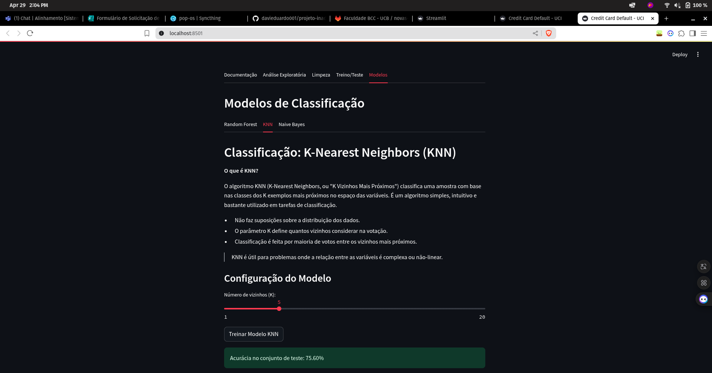

# Projeto de Previsão de Inadimplência em Cartões de Crédito

[](https://python.org)
[](https://streamlit.io)

## Objetivo
Prever a probabilidade de um cliente inadimplir (não pagar) no próximo mês, com base em dados históricos de pagamentos.

## Dataset
**Fonte**: [Default of Credit Card Clients](https://www.kaggle.com/datasets/uciml/default-of-credit-card-clients-dataset) no Kaggle

## Variáveis do Dataset

| Variável | Descrição | Valores/Formato |
|----------|-----------|-----------------|
| ID | Identificação do cliente | Número único |
| LIMIT_BAL | Limite de crédito | NT$ (inclui crédito individual e familiar) |
| SEX | Gênero | 1=masculino, 2=feminino |
| EDUCATION | Escolaridade | 1=pós-graduação, 2=universitário, 3=ensino médio, 4=outros, 5-6=desconhecido |
| MARRIAGE | Estado civil | 1=casado, 2=solteiro, 3=outros |
| AGE | Idade | Anos completos |
| PAY_0 a PAY_6 | Status de pagamento (-1 a 9) | -1=pago em dia, 1=atraso 1 mês, ..., 9=atraso ≥9 meses |
| BILL_AMT1 a BILL_AMT6 | Valor da fatura | NT$ (últimos 6 meses) |
| PAY_AMT1 a PAY_AMT6 | Valor pago | NT$ (últimos 6 meses) |
| default.payment.next.month | Inadimplência | 0=não, 1=sim |

*Observação: PAY_0 refere-se a setembro/2005, PAY_1 a agosto/2005, ..., PAY_6 a abril/2005*

## Métodos
- **Pré-processamento**:
  - Limpeza de dados
  - Análise exploratória (EDA)
  - Feature engineering

## Modelos Implementados

O aplicativo permite comparar diferentes algoritmos de classificação de inadimplência:
- **Random Forest**
- **KNN (K-Nearest Neighbors)**
- **Naive Bayes**

Cada modelo pode ser treinado e avaliado separadamente na aba "Modelos" do dashboard.

## Métricas de Avaliação

O dashboard apresenta as principais métricas para avaliação dos modelos:

### Matriz de Confusão
Tabela que mostra os acertos e erros do modelo, separando Verdadeiros Positivos (VP), Falsos Positivos (FP), Verdadeiros Negativos (VN) e Falsos Negativos (FN). Útil para visualizar tipos de erro.

### Precision e Recall
- **Precisão (Precision):** Proporção de previsões positivas que realmente eram positivas.
- **Recall (Sensibilidade):** Proporção de positivos reais que o modelo conseguiu identificar.

### Curva ROC e AUC
- **Curva ROC:** Mostra a relação entre taxa de verdadeiros positivos e falsos positivos.
- **AUC:** Mede a capacidade do modelo em distinguir entre as classes (quanto mais próximo de 1, melhor).

## Como Usar
```bash
pip install -r requirements.txt
streamlit run src/app.py
```

## Deploy com Docker

Você pode rodar o dashboard em qualquer ambiente com Docker:

```bash
# 1. Construa a imagem Docker
docker build -t inadimplencia-app .

# 2. (Opcional) Remova container antigo se necessário
# docker rm -f inadimplencia-app

# 3. Rode o container
# O app estará disponível em http://localhost:8501

docker run -d -p 8501:8501 --name inadimplencia-app inadimplencia-app
```

## Saídas
- Dashboard interativo no Streamlit
- Visualização das métricas e comparação entre modelos



*Normalização dos dados é feita automaticamente durante o pipeline.*