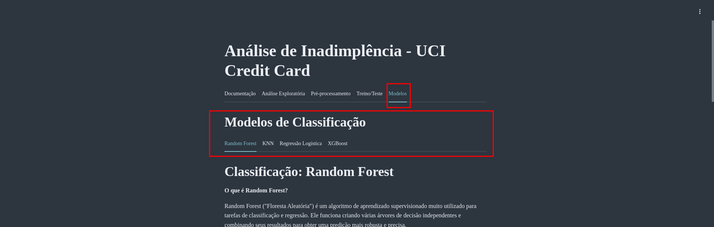
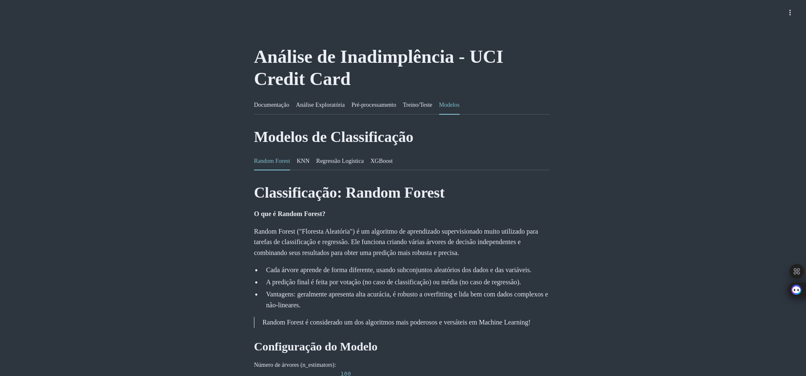
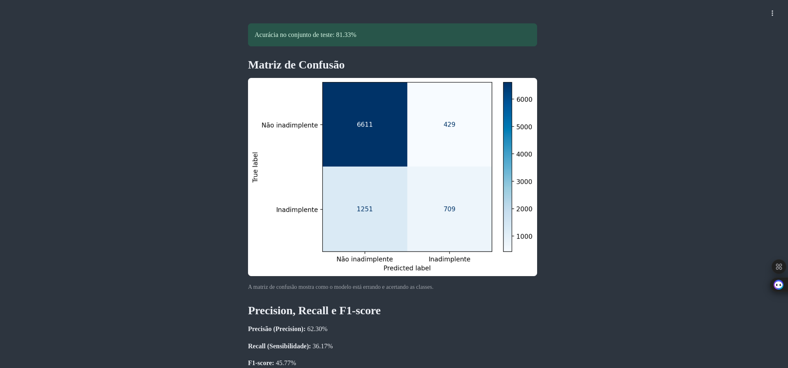
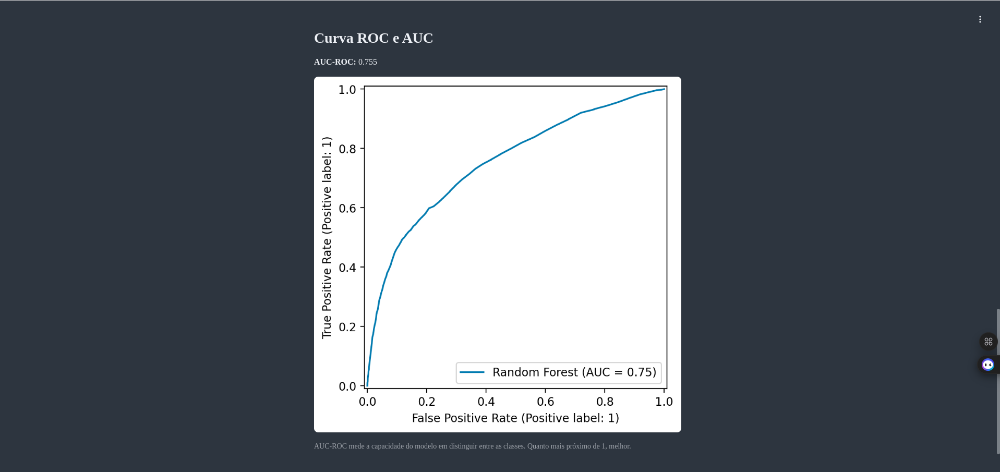

# Projeto de Previsão de Inadimplência em Cartões de Crédito

[](https://python.org)
[](https://streamlit.io)

---

## 💡 Sobre o Projeto
Este projeto é um dashboard interativo desenvolvido em Python com Streamlit para comparar e visualizar diferentes modelos de machine learning aplicados à inadimplência de cartões de crédito. O objetivo principal é facilitar o estudo inicial de Ciência de Dados, permitindo ao usuário explorar, treinar e comparar modelos de forma prática e visual.

---

## 📊 Objetivo
O foco do projeto é a comparação entre modelos de classificação para fins didáticos e exploratórios, servindo como ponto de partida para estudos em Ciência de Dados.

---

## 📁 Dataset
**Fonte:** [Default of Credit Card Clients (Kaggle)](https://www.kaggle.com/datasets/uciml/default-of-credit-card-clients-dataset)

O dataset contém informações demográficas, histórico de pagamentos e limites de crédito de clientes.

### Principais Variáveis
| Variável | Descrição | Valores/Formato |
|----------|-----------|-----------------|
| ID | Identificação do cliente | Número único |
| LIMIT_BAL | Limite de crédito | NT$ (inclui crédito individual e familiar) |
| SEX | Gênero | 1=masculino, 2=feminino |
| EDUCATION | Escolaridade | 1=pós-graduação, 2=universitário, 3=ensino médio, 4=outros, 5-6=desconhecido |
| MARRIAGE | Estado civil | 1=casado, 2=solteiro, 3=outros |
| AGE | Idade | Anos completos |
| PAY_0 a PAY_6 | Status de pagamento (-1 a 9) | -1=pago em dia, 1=atraso 1 mês, ..., 9=atraso ≥9 meses |
| BILL_AMT1 a BILL_AMT6 | Valor da fatura | NT$ (últimos 6 meses) |
| PAY_AMT1 a PAY_AMT6 | Valor pago | NT$ (últimos 6 meses) |
| default.payment.next.month | Inadimplência | 0=não, 1=sim |

*PAY_0 refere-se a setembro/2005, PAY_1 a agosto/2005, ..., PAY_6 a abril/2005*

---

## ⚙️ Pipeline e Funcionalidades
- **Análise Exploratória (EDA):**
  - Estatísticas descritivas
  - Gráficos de distribuição e correlação
- **Pré-processamento:**
  - Tratamento de outliers
  - Codificação de variáveis categóricas
  - Normalização/Escalonamento
- **Modelagem:**
  - Treinamento e avaliação de múltiplos modelos
  - Comparação visual de métricas

---

## 🤖 Modelos Implementados
- Random Forest
- KNN (K-Nearest Neighbors)
- Regressão Logística
- XGBoost

Cada modelo pode ser treinado e avaliado separadamente na aba "Modelos" do dashboard.



---

## 📏 Métricas de Avaliação
- **Matriz de Confusão:** Visualização dos acertos e erros do modelo
- **Precisão (Precision):** Proporção de previsões positivas corretas
- **Recall (Sensibilidade):** Proporção de positivos reais identificados
- **F1-score:** Média harmônica entre precisão e recall, especialmente útil para datasets desbalanceados
- **Curva ROC & AUC:** Avaliação da capacidade do modelo em distinguir classes

---

## 🚀 Como Rodar o Projeto

### 1. Usando Docker Compose (Recomendado)
```bash
docker compose up --build
```
Acesse: http://localhost:8501

### 2. Usando Docker (Manual)
```bash
docker build -t inadimplencia-app .
docker run -d -p 8501:8501 --name inadimplencia-app inadimplencia-app
```
Acesse: http://localhost:8501

### 3. Usando Ambiente Virtual Python
```bash
python3 -m venv .venv
source .venv/bin/activate
pip install -r requirements.txt
streamlit run src/app.py
```
Acesse: http://localhost:8501

---

## 🖥️ Estrutura do Projeto
```
projeto_de_merda_n2/
├── src/
│   ├── app.py               # Código principal do Streamlit
│   ├── tabs/                # Módulos de cada aba (EDA, modelos, etc)
│   └── data/                # Base de dados CSV
├── requirements.txt         # Dependências Python
├── Dockerfile               # Dockerfile para build da imagem
├── docker-compose.yml       # Orquestração com Docker Compose
└── README.md
```

---

## 📈 Saídas
- Dashboard interativo no Streamlit
- Visualização das métricas e comparação entre modelos





---